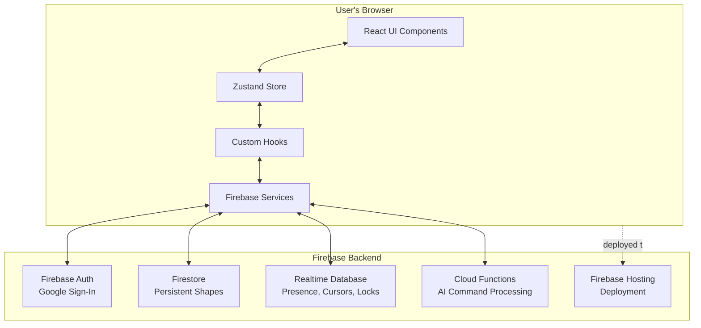

# CollabCanvas

> **Real-time collaborative canvas** - A Figma-style collaborative drawing tool built with React, Firebase, and Konva.js

## 🌐 [Live Demo](https://collabcanvas-dev.web.app/)

[](https://collabcanvas-dev.web.app/)
[](https://github.com/gauntletai/collabcanvas)
[](https://github.com/gauntletai/collabcanvas)

## 🎯 Overview

CollabCanvas is a **minimal, high-performance collaborative canvas** that enables multiple users to create and move shapes together in real-time. Built as an MVP to demonstrate real-time collaboration capabilities with sub-100ms sync latency and 60 FPS performance.

### Key Features

- 🎨 **Real-time Collaboration** - Multiple users can create and move shapes simultaneously
- 🔒 **Conflict Prevention** - Shape locking prevents simultaneous edit conflicts  
- 👥 **Live Presence** - See other users' cursors and active user count
- ⚡ **High Performance** - 60 FPS interactions, <100ms shape sync, <50ms cursor updates
- 🤖 **AI Canvas Agent** - Natural language commands for shape creation and manipulation
- 🔐 **Google Authentication** - Simple Google Sign-In integration
- 📱 **Responsive Design** - Works on desktop and mobile devices
- 🌐 **Firebase Backend** - Scalable real-time infrastructure

## 🏗️ Architecture

### Technology Stack

**Frontend:**
- **React 18+** with TypeScript
- **Konva.js + react-konva** for high-performance canvas rendering
- **Zustand** for centralized state management
- **Tailwind CSS** for styling
- **Vite** for fast development and optimized builds

**Backend:**
- **Firebase Authentication** (Google Sign-In)
- **Cloud Firestore** for persistent shape data
- **Realtime Database (RTDB)** for ephemeral data (presence, cursors, locks)
- **Firebase Cloud Functions** for AI command processing
- **Firebase Hosting** for deployment

### Data Flow



## 🚀 Quick Start

### Prerequisites

- **Node.js** 18+ and npm
- **Firebase CLI** (`npm install -g firebase-tools`)
- **Google Cloud Project** with Firebase enabled

### 1. Clone and Install

```bash
git clone https://github.com/gauntletai/collabcanvas.git
cd collabcanvas/collabcanvas
npm install
```

### 2. Firebase Setup

1. **Create Firebase Project:**
   ```bash
   firebase login
   firebase projects:create your-project-id
   firebase use your-project-id
   ```

2. **Enable Services:**
   ```bash
   # Enable Authentication (Google provider)
   firebase auth:enable
   
   # Enable Firestore Database
   firebase firestore:enable
   
   # Enable Realtime Database
   firebase database:enable
   
   # Enable Cloud Functions
   firebase functions:enable
   
   # Enable Hosting
   firebase hosting:enable
   ```

3. **Configure Environment:**
   ```bash
   # Copy environment template
   cp .env.example .env
   
   # Add your Firebase config to .env
   VITE_FIREBASE_API_KEY=your_api_key
   VITE_FIREBASE_AUTH_DOMAIN=your_project.firebaseapp.com
   VITE_FIREBASE_PROJECT_ID=your_project_id
   VITE_FIREBASE_STORAGE_BUCKET=your_project.appspot.com
   VITE_FIREBASE_MESSAGING_SENDER_ID=your_sender_id
   VITE_FIREBASE_APP_ID=your_app_id
   VITE_FIREBASE_DATABASE_URL=https://your_project.firebaseio.com
   
   # Add OpenAI API key for AI features
   OPENAI_API_KEY=your_openai_api_key
   ```

### 3. Deploy Security Rules

```bash
# Deploy Firestore security rules
firebase deploy --only firestore:rules

# Deploy RTDB security rules  
firebase deploy --only database

# Deploy Cloud Functions
firebase deploy --only functions
```

### 4. Development

```bash
# Start Firebase emulators (recommended for development)
firebase emulators:start

# In another terminal, start the React dev server
npm run dev
```

Visit `http://localhost:5173` to see the application running locally.

### 5. Production Deployment

```bash
# Build for production
npm run build

# Deploy to Firebase Hosting and Functions
firebase deploy
```

Your app will be available at `https://your-project-id.web.app`

## 📁 Project Structure

```
collabcanvas/
├── src/
│   ├── components/          # React components
│   │   ├── Canvas.tsx       # Main Konva canvas
│   │   ├── Shape.tsx        # Rectangle component
│   │   ├── Toolbar.tsx      # Top toolbar with AI Assistant
│   │   ├── CursorOverlay.tsx # Live cursors
│   │   ├── LockOverlay.tsx  # Username overlays
│   │   ├── AuthButton.tsx   # Google Sign-In
│   │   ├── AICommandInput.tsx # AI command interface
│   │   └── AIClarificationDialog.tsx # AI clarification UI
│   ├── hooks/               # Custom React hooks
│   │   ├── useAuth.ts       # Firebase auth
│   │   ├── useShapes.ts     # Firestore sync
│   │   ├── usePresence.ts   # RTDB presence
│   │   └── useLocks.ts      # Shape locking
│   ├── services/            # Firebase services
│   │   ├── firebase.ts      # Firebase config
│   │   ├── firestore.ts     # Shape operations
│   │   ├── rtdb.ts          # Presence & locks
│   │   ├── aiService.ts     # AI command processing
│   │   └── aiCommandExecutor.ts # AI command execution
│   ├── store/               # Zustand state
│   │   └── canvasStore.ts   # Centralized state with AI
│   ├── types.ts             # TypeScript definitions
│   └── utils/               # Utilities
│       ├── throttle.ts      # Performance throttling
│       └── colors.ts        # User color assignment
├── functions/               # Firebase Cloud Functions
│   ├── src/
│   │   ├── index.ts         # Functions entry point
│   │   └── aiCommand.ts     # AI command processing
│   └── package.json         # Functions dependencies
├── firestore.rules          # Firestore security rules
├── database.rules.json      # RTDB security rules
├── firebase.json            # Firebase config
└── package.json
```

## 🎮 Usage

### For Users

1. **Sign In** - Click "Sign in with Google" to authenticate
2. **Create Shapes** - Click "Create Rectangle" to add 100x100px blue rectangles
3. **Move Shapes** - Click and drag shapes to new positions
4. **AI Commands** - Click "AI Assistant" and use natural language:
   - "Create a red circle"
   - "Move shapes to center"
   - "Align shapes to left"
   - "Create a login form"
   - "Export canvas as PNG"
5. **Collaborate** - See other users' cursors and active user count
6. **Lock Management** - First user to click a shape locks it; others see username overlay
7. **Undo/Redo** - Use Ctrl+Z/Cmd+Z to undo AI commands and other actions

### For Developers

- **Performance Monitoring** - FPS counter shows real-time performance
- **Real-time Sync** - Shapes sync across users in <100ms
- **Cursor Updates** - Cursor positions update in <50ms
- **Shape Locking** - Prevents simultaneous edit conflicts
- **AI Integration** - OpenAI-powered natural language commands
- **Command Queue** - First-come-first-serve AI command processing
- **Rate Limiting** - 10 commands per user per minute

## 🧪 Testing

```bash
# Run unit tests
npm test

# Run tests with Firebase emulators
firebase emulators:exec --only firestore,database,auth,functions "npm test"

# Run integration tests
npm run test:integration

# Run performance tests
npm run test:perf
```

## 📊 Performance Targets

- ✅ **60 FPS** during all interactions (pan, zoom, drag)
- ✅ **< 100ms** shape sync latency between users  
- ✅ **< 50ms** cursor position sync latency
- ✅ **< 2s** AI command response time
- ✅ **90%+** AI command accuracy
- ✅ **500+ shapes** without FPS drops
- ✅ **5+ concurrent users** without degradation

## 📚 Performance Optimization Plan

- Performance PRD: [docs/prd-performance.md](./docs/prd-performance.md)
- Performance Stories:
  - [Story 1.1: Performance Hardening](./docs/stories/1.1.performance-hardening.md)
  - [Story 1.2: Rendering Pipeline Optimization](./docs/stories/1.2.rendering-optimization.md)
  - [Story 1.3: State Update Optimization](./docs/stories/1.3.state-update-optimization.md)
  - [Story 1.4: Network Write Optimization](./docs/stories/1.4.network-write-optimization.md)

## 🔒 Security

- **Authentication Required** - All users must sign in with Google
- **Schema Validation** - Firestore rules enforce shape properties
- **User Isolation** - Users can only modify their own presence/locks
- **Rate Limiting** - Throttled updates prevent spam

## 🚧 Current Limitations (MVP)

- **Single Board** - One global board (no board management)
- **Basic Shapes** - Rectangles, circles, lines, and text
- **Limited Editing** - Basic shape properties (color, size, position)
- **AI Commands** - Natural language commands for common operations

## 🔮 Future Roadmap

### Phase 2
- Advanced shape properties (gradients, shadows, borders)
- Shape grouping and layers
- Advanced AI templates (dashboards, wireframes)
- Voice command support

### Phase 3 (AI Integration) ✅ **COMPLETED**
- ✅ Natural language commands: "create a blue rectangle"
- ✅ AI-powered shape generation from descriptions
- ✅ Complex command templates (login forms, navigation bars)
- ✅ Multi-user AI command queuing
- ✅ AI command undo/redo integration

## 🤝 Contributing

1. Fork the repository
2. Create a feature branch (`git checkout -b feature/amazing-feature`)
3. Commit your changes (`git commit -m 'Add amazing feature'`)
4. Push to the branch (`git push origin feature/amazing-feature`)
5. Open a Pull Request

## 📄 License

This project is licensed under the MIT License - see the [LICENSE](LICENSE) file for details.

## 🙏 Acknowledgments

- **Konva.js** for high-performance canvas rendering
- **Firebase** for real-time backend infrastructure
- **React** and **Zustand** for modern frontend architecture
- **Tailwind CSS** for rapid UI development

---

**Built with ❤️ for real-time collaboration**

[Live Demo](https://collabcanvas-dev.web.app/) • [Documentation](./architecture.md) • [Issues](https://github.com/gauntletai/collabcanvas/issues)
• [Docs Index](./docs/index.md)