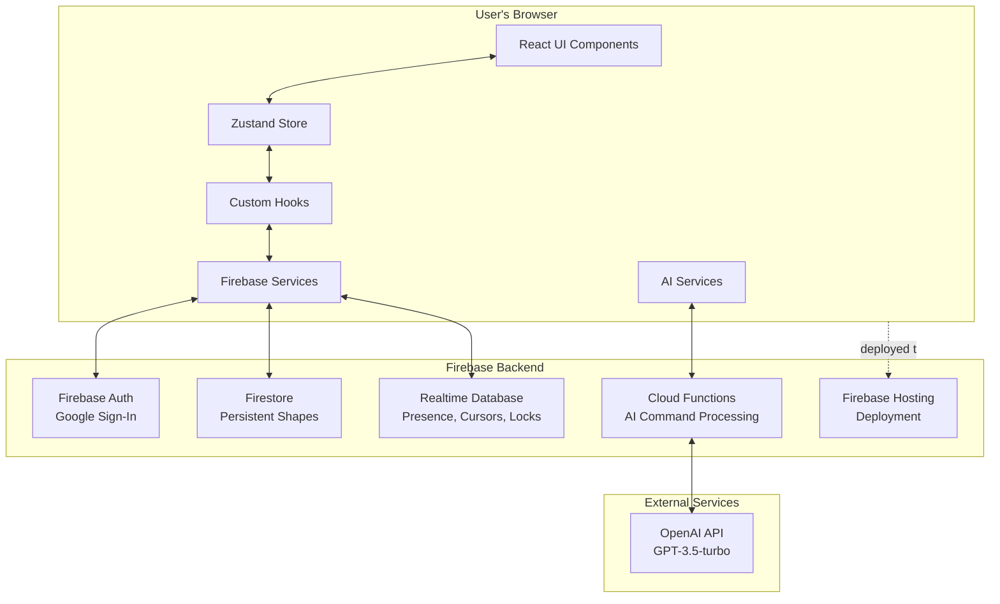
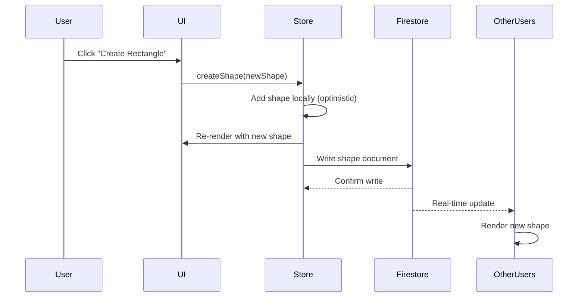
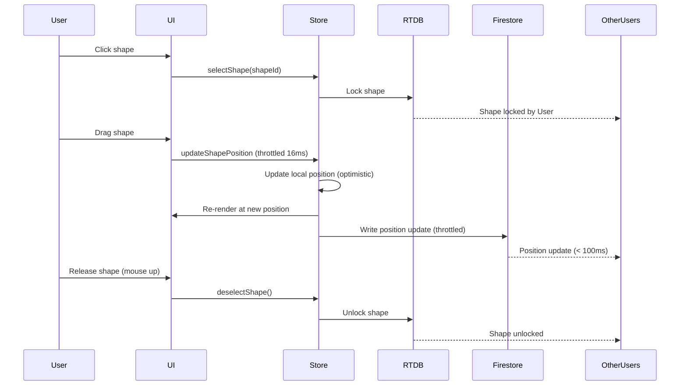
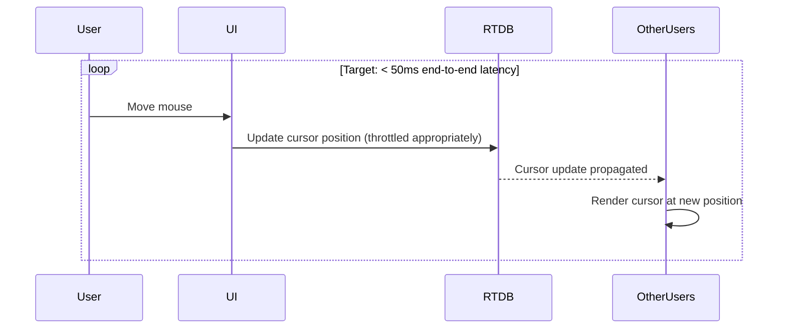

# CollabCanvas Architecture

> **Phase 1 MVP Architecture** - Aligned with PRD and Implementation Tasks

---

## High-Level System Architecture



---

## Technology Stack

### Frontend
- **React 18+** with TypeScript for UI components
- **Vite** for build tooling (fast dev server, optimized builds)
- **Konva.js + react-konva** for high-performance canvas rendering
- **Zustand** for centralized state management
- **Tailwind CSS** for styling
- **Firebase SDK** for backend integration

### Backend
- **Firebase Authentication** (Google Sign-In)
- **Cloud Firestore** for persistent shape data
- **Realtime Database (RTDB)** for ephemeral data (presence, cursors, locks)
- **Firebase Cloud Functions** for AI command processing
- **Firebase Hosting** for deployment

### External Services
- **OpenAI API** (GPT-3.5-turbo) for natural language processing
- **LangChain** for command validation and parsing

### Development Tools
- **TypeScript** for type safety
- **Firebase Emulator Suite** for local development and testing
- **Vitest/Jest** for unit tests
- **React Testing Library** for component tests

---

## Data Architecture

### Firestore (Persistent Data)

```
boards/{boardId}/shapes/{shapeId}
  ├── id: string (document id)
  ├── type: 'rect' (fixed for MVP)
  ├── x: number (position)
  ├── y: number (position)
  ├── w: 100 (fixed, not editable)
  ├── h: 100 (fixed, not editable)
  ├── color: '#3B82F6' (fixed, not editable)
  ├── createdAt: serverTimestamp
  ├── createdBy: userId
  ├── updatedAt: serverTimestamp
  ├── updatedBy: userId
  └── clientUpdatedAt: number (client send timestamp for LWW)
```

**Key Decisions:**
- Single global board (hardcoded ID: 'global')
- One Firestore collection listener for all shapes (not per-shape)
- Only position (x, y) can be updated; size and color are fixed
- No deletion in MVP (create and update only)

### Realtime Database (Ephemeral Data)

```
presence/
  └── {userId}
      ├── name: string
      ├── color: string (random assigned)
      ├── cursor: { x: number, y: number }
      ├── lastSeen: serverTimestamp
      └── isActive: boolean

locks/
  └── {shapeId}
      ├── userId: string
      ├── userName: string
      └── lockedAt: serverTimestamp
```

**Key Decisions:**
- RTDB for < 50ms latency requirements (target)
- Auto-cleanup using `.onDisconnect()`
- Lock timeout after 30 seconds of inactivity

---

## Client Architecture

### Component Hierarchy

```
App.tsx
└── Board.tsx (authenticated users only)
    ├── Toolbar.tsx
    │   ├── AuthButton.tsx
    │   ├── Create Rectangle Button
    │   ├── User Info Display
    │   ├── Active Users Count
    │   └── FPS Counter
    └── Canvas.tsx (Konva Stage)
        ├── Shape.tsx (100x100px blue rectangles)
        ├── LockOverlay.tsx (username on locked shapes)
        └── CursorOverlay.tsx (other users' cursors)
```

### State Management (Zustand)

```typescript
interface CanvasStore {
  // Shapes
  shapes: Map<string, Shape>
  createShape: (shape: Shape) => void
  updateShapePosition: (id: string, x: number, y: number) => void
  
  // Selection
  selectedShapeId: string | null
  selectShape: (id: string) => void
  deselectShape: () => void
  
  // Locks
  locks: Map<string, Lock>
  lockShape: (shapeId: string, userId: string, userName: string) => void
  unlockShape: (shapeId: string) => void
  
  // Presence
  users: Map<string, PresenceData>
  updatePresence: (userId: string, data: PresenceData) => void
  removeUser: (userId: string) => void
  
  // Current User
  currentUser: User | null
  setCurrentUser: (user: User) => void
}
```

### Custom Hooks

**useAuth** (PR #2)
- Manages Firebase Auth state
- Provides user info (uid, name, photoURL)
- Handles Google Sign-In flow

**useShapes** (PR #5)
- Single Firestore collection listener
- Syncs shapes to Zustand store
- Handles create and update operations
- Throttles drag updates to 16ms (60 FPS)
- Optimistic UI updates

**usePresence** (PR #6)
- RTDB listener for all user presence
- Updates cursor positions targeting < 50ms end-to-end latency (optimize throttles accordingly)
- Auto-cleanup with `.onDisconnect()`
- Assigns random colors to users

**useLocks** (PR #7)
- RTDB listener for shape locks
- First-click locking mechanism
- Auto-release on drag end, disconnect, or 30s timeout
- Prevents simultaneous movement conflicts

### Services Layer

**firebase.ts**
- Initialize Firebase app
- Export auth, firestore, rtdb instances

**firestore.ts**
- `createShape(id: string, x: number, y: number, userId: string): Promise<void>`
- `updateShapePosition(id: string, x: number, y: number, userId: string, clientTimestamp: number): Promise<void>`
- `subscribeToShapes(callback: (shapes: FirestoreShape[]) => void): Unsubscribe`
- `subscribeToShapesChanges(callback: (changes: FirestoreShapeChange[]) => void): Unsubscribe`

**rtdb.ts**
- `updatePresence(userId: string, data: PresenceData): Promise<void>`
- `updateCursor(userId: string, x: number, y: number): Promise<void>`
- `lockShape(shapeId: string, lock: Lock): Promise<void>`
- `unlockShape(shapeId: string): Promise<void>`
- `listenToPresence(callback: (users: PresenceData[]) => void): Unsubscribe`
- `listenToLocks(callback: (locks: Lock[]) => void): Unsubscribe`

---

## Data Flow

### Shape Creation Flow



### Shape Movement Flow



### Cursor Movement Flow



---

## Performance Optimizations

### Target Metrics
- **60 FPS** during all interactions (pan, zoom, drag)
- **< 100ms** shape sync latency between users
- **< 50ms** cursor position sync latency
- **500+ shapes** without FPS drops
- **5+ concurrent users** without degradation

### Optimization Strategies

**1. Throttling**
- Drag updates: 16ms intervals (≈62 updates/sec)
- Cursor updates: 16ms intervals (≈60Hz)
- Prevents excessive network writes

**2. Optimistic UI Updates**
- Immediately update local state
- Write to Firestore/RTDB asynchronously
- Users see instant feedback

**3. Single Firestore Listener**
- One listener for entire shapes collection
- More efficient than per-shape listeners
- Scales to 500+ shapes

**4. RTDB for High-Frequency Data**
- Lower latency than Firestore (50ms vs 200-500ms)
- Better suited for cursors and locks
- Automatic cleanup with `.onDisconnect()`

**5. Konva Layer Caching**
- Cache static layers
- Redraw only changed shapes
- Efficient GPU utilization

**6. Bounded Canvas**
- Viewport-sized canvas (not infinite)
- Simpler rendering logic
- Better performance

---

## Security

### Firestore Security Rules

```javascript
rules_version = '2';
service cloud.firestore {
  match /databases/{database}/documents {
    match /boards/{boardId}/shapes/{shapeId} {
      // Auth required for all operations
      allow read: if request.auth != null;
      allow create: if request.auth != null
        && request.resource.data.type == 'rect'
        && request.resource.data.w == 100
        && request.resource.data.h == 100
        && request.resource.data.color == '#3B82F6'
        && request.resource.data.createdBy == request.auth.uid;
      allow update: if request.auth != null
        && request.resource.data.updatedBy == request.auth.uid
        // Only position can change
        && request.resource.data.w == resource.data.w
        && request.resource.data.h == resource.data.h
        && request.resource.data.color == resource.data.color
        && request.resource.data.type == resource.data.type
        && request.resource.data.createdBy == resource.data.createdBy
        && request.resource.data.createdAt == resource.data.createdAt;
    }
    // Deny all other paths
    match /{document=**} {
      allow read, write: if false;
    }
  }
}
```

### RTDB Security Rules

```json
{
  "rules": {
    "presence": {
      "$userId": {
        ".read": "auth != null",
        ".write": "auth != null && auth.uid == $userId"
      }
    },
    "locks": {
      "$shapeId": {
        ".read": "auth != null",
        ".write": "auth != null && (!data.exists() || data.child('userId').val() == auth.uid)"
      }
    }
  }
}
```

---

## Implementation Phases (PRs)

### PR #1: Project Bootstrap & Firebase Setup
- Initialize React 18+ with Vite + TypeScript
- Install dependencies (react, konva, zustand, firebase, tailwindcss)
- Configure Tailwind CSS
- Set up Firebase services layer
- Configure emulators

### PR #2: Authentication (Google Sign-In)
- `useAuth` hook
- Toolbar with user info display
- Google Sign-In flow
- Auth-gated canvas access

### PR #3: Canvas Renderer (Konva Integration)
- Konva stage & layer setup
- Pan and zoom at 60 FPS
- Viewport-sized bounded canvas
- FPS counter in toolbar
- Light gray background (#F5F5F5)

### PR #4: Shape Creation & Movement (Local State)
- `Shape.tsx` component (100x100px, #3B82F6)
- "Create Rectangle" button
- Drag-to-move interaction
- Zustand store setup
- Boundary checking

### PR #5: Firestore Realtime Sync (Shapes)
- Single collection listener for global board
- Create and update operations
- 16ms throttled drag writes
- Last-Write-Wins conflict resolution
- Optimistic UI updates

### PR #6: Presence & Cursors (RTDB)
- `usePresence` hook
- Cursor overlay with name labels
- 60Hz cursor updates
- Active users count
- Random color assignment
- `.onDisconnect()` cleanup

### PR #7: Shape Locking (RTDB)
- `useLocks` hook
- First-click locking mechanism
- Username overlay on locked shapes
- Auto-release (mouse up, disconnect, 30s timeout)
- Disable interaction on locked shapes

### PR #8: Security Rules (Firestore + RTDB)
- Firestore rules with field validation
- RTDB rules for presence and locks
- Fixed property validation (100x100, #3B82F6)
- Auth checks
- Rules unit tests

### PR #9: Offline Handling & Resync
- Firestore offline persistence
- Queue unsent updates
- Resync on reconnect
- Clear stale locks

### PR #10: Deployment (Firebase Hosting)
- Production build configuration
- Environment variables
- Deploy to Firebase Hosting
- Performance validation

---

## Testing Strategy

### Unit Tests
- Zustand store actions and selectors
- Throttle utilities (16ms intervals)
- Auth state transitions
- Boundary checking math
- Lock timeout logic

### Integration Tests (Emulator)
- Firestore CRUD operations
- Shape schema validation
- Conflict resolution (LWW)
- Presence join/leave
- Cursor propagation
- Lock acquisition and release
- `.onDisconnect()` cleanup
- Offline queue and resync

### Security Rules Tests
- Auth requirements
- Field validation
- Fixed property enforcement
- User-specific write constraints

### Manual Performance Tests
- 60 FPS during interactions
- < 100ms shape sync
- < 50ms cursor updates
- 500+ shapes benchmark
- 5+ concurrent users test

---

## Key Architectural Decisions

### 1. Single Global Board
**Decision:** Hardcoded board ID 'global', no board management  
**Rationale:** Simplifies MVP, reduces complexity, enables faster iteration

### 2. Single Firestore Listener
**Decision:** One listener for entire shapes collection  
**Rationale:** More efficient than per-shape listeners, scales to 500+ shapes

### 3. RTDB for Ephemeral Data
**Decision:** Use RTDB for presence, cursors, and locks  
**Rationale:** Lower latency (< 50ms), better for high-frequency updates, built-in `.onDisconnect()`

### 4. Shape Locking via RTDB
**Decision:** First-click locks in RTDB with username overlay  
**Rationale:** Prevents conflicts entirely, simple UX, automatic cleanup on disconnect

### 5. Fixed Shape Properties
**Decision:** All rectangles are 100x100px, #3B82F6, fixed  
**Rationale:** Simplifies MVP, reduces UI complexity, enforces consistency

### 6. No Deletion in MVP
**Decision:** Create and move only, no shape deletion  
**Rationale:** Reduces complexity, avoids undo/redo requirements, faster MVP

### 7. Viewport-Sized Canvas
**Decision:** Bounded canvas matching viewport, not infinite  
**Rationale:** Simpler implementation, better performance, clear boundaries

### 8. Throttled Updates
**Decision:** 16ms throttle for both shapes and cursors  
**Rationale:** Achieves 60 FPS target, reduces Firebase costs, prevents network flooding

### 9. Optimistic UI
**Decision:** Update local state immediately, sync asynchronously  
**Rationale:** Smooth UX, perceived instant feedback, handles latency gracefully

### 10. TypeScript + Tailwind
**Decision:** TypeScript for type safety, Tailwind for styling  
**Rationale:** Best practices, rapid development, maintainable code

---

## Future Expansion Considerations

### Code Preparation for Phase 2/3
- **Command/Action Pattern:** Centralize shape operations for easy AI integration
- **Extensible Shape Types:** Design shape system to support circles, text, lines
- **Clean Separation:** Keep business logic separate from UI components
- **Type System:** Use discriminated unions for shape types

## Future Expansion Considerations

### Code Preparation for Phase 2/3
- **Command/Action Pattern:** Centralize shape operations for easy AI integration ✅
- **Extensible Shape Types:** Design shape system to support circles, text, lines ✅
- **Clean Separation:** Keep business logic separate from UI components ✅
- **Type System:** Use discriminated unions for shape types ✅

### AI Integration (Phase 3) ✅ **COMPLETED**
- ✅ Natural language command parser
- ✅ Shape generation from text descriptions
- ✅ Integration points structured in services layer
- ✅ Command pattern enables AI to trigger actions programmatically
- ✅ Multi-user AI command queuing
- ✅ Complex command templates
- ✅ AI command undo/redo integration

---

## File Structure

```
collabcanvas/
├── public/
│   └── index.html
├── src/
│   ├── components/
│   │   ├── Canvas.tsx
│   │   ├── Shape.tsx
│   │   ├── Toolbar.tsx
│   │   ├── CursorOverlay.tsx
│   │   ├── LockOverlay.tsx
│   │   └── AuthButton.tsx
│   ├── hooks/
│   │   ├── useShapes.ts
│   │   ├── usePresence.ts
│   │   ├── useLocks.ts
│   │   └── useAuth.ts
│   ├── pages/
│   │   ├── Board.tsx
│   │   └── Login.tsx
│   ├── services/
│   │   ├── firebase.ts
│   │   ├── firestore.ts
│   │   └── rtdb.ts
│   ├── store/
│   │   └── canvasStore.ts
│   ├── utils/
│   │   ├── throttle.ts
│   │   └── colors.ts
│   ├── App.tsx
│   ├── main.tsx
│   └── types.ts
├── firestore.rules
├── database.rules.json
├── firebase.json
├── .firebaserc
├── package.json
├── tsconfig.json
├── vite.config.ts
├── tailwind.config.js
├── postcss.config.js
└── .env
```

---

## Summary

This architecture delivers a high-performance, real-time collaborative canvas with:
- ✅ 60 FPS smooth interactions
- ✅ < 100ms shape sync between users
- ✅ < 50ms cursor updates
- ✅ Conflict-free collaboration via shape locking
- ✅ Scalable to 500+ shapes and 5+ users
- ✅ Simple, maintainable codebase
- ✅ Ready for future AI integration

**Status:** Architecture complete and aligned with PRD and implementation tasks. Ready for development.
